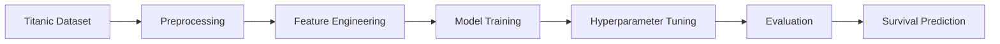

# 🚢 Titanic Survival Prediction

<p align="left">
  
  
  
  
</p>

A machine learning system for predicting passenger survival on the Titanic using classical ML models, structured feature engineering, and comprehensive model evaluation.

---

## Overview

The Titanic disaster remains one of history's most studied events in data science. This project explores how passenger attributes — such as age, gender, class, and fare — can be used to predict survival outcomes using classical machine learning.

The repository demonstrates a complete machine learning workflow:

- Exploratory Data Analysis
- Data Preprocessing
- Feature Engineering
- Model Training
- Hyperparameter Optimization
- Cross-Validation
- Performance Evaluation

---

## Architecture

### Dataset Features

| Feature | Description |
|---|---|
| `Pclass` | Passenger ticket class (1st, 2nd, 3rd) |
| `Sex` | Gender of the passenger |
| `Age` | Age in years |
| `SibSp` | Number of siblings / spouses aboard |
| `Parch` | Number of parents / children aboard |
| `Fare` | Ticket fare paid |
| `Embarked` | Port of embarkation (C, Q, S) |
| `Cabin` | Cabin number (heavily missing) |
| `Survived` | Target label — 0 = No, 1 = Yes |

### Models Used

| Model | Purpose |
|---|---|
| Linear Regression | Regression baseline |
| Ridge Regression | Regularized regression baseline |
| XGBoost Classifier | Main predictive model |
| Random Forest Classifier | Ensemble predictive model |
| GridSearchCV | Hyperparameter optimization |
| K-Fold Cross Validation | Model validation |

### Tech Stack

`Python` · `Scikit-learn` · `XGBoost` · `Pandas` · `NumPy` · `Matplotlib` · `Seaborn` · `Plotly` · `Jupyter Notebook`

---

## Architecture




---

## Installation

**Clone the repository**
```bash
git clone https://github.com/your-username/titanic-survival-prediction.git
cd titanic-survival-prediction
```

**Install dependencies**
```bash
pip install pandas numpy scipy matplotlib seaborn plotly scikit-learn xgboost jupyter
```

**Run the notebook**
```bash
jupyter notebook titanic-survival-prediction.ipynb
```

---

## Key Features

- Binary survival classification from passenger metadata
- Age group binning and feature engineering
- Correlation heatmaps and survival distribution visualizations
- Feature importance analysis via Random Forest
- Cross-validation evaluation
- Hyperparameter optimization with GridSearchCV

---

## Future Scope

- Integration with larger historical passenger datasets
- Deep learning-based classification (MLP, TabNet)
- Interactive survival prediction dashboard
- Advanced ensemble and stacking methods
- SHAP-based model interpretability

---

## License

This project is open-source and available under the [MIT License](LICENSE).
